# Social-Media
A social media app made in Laravel and React, created using a MySQL Database and a websocket service named Pusher.Has a lot of functions,like uploading files, creating posts,videos and stories, placing comments and likes, real time messaging and notification system, a search bar, friends page, profile page and many more.It took 2 months to develop.It also contains a task queue and a task scheduler implemented using Redis.

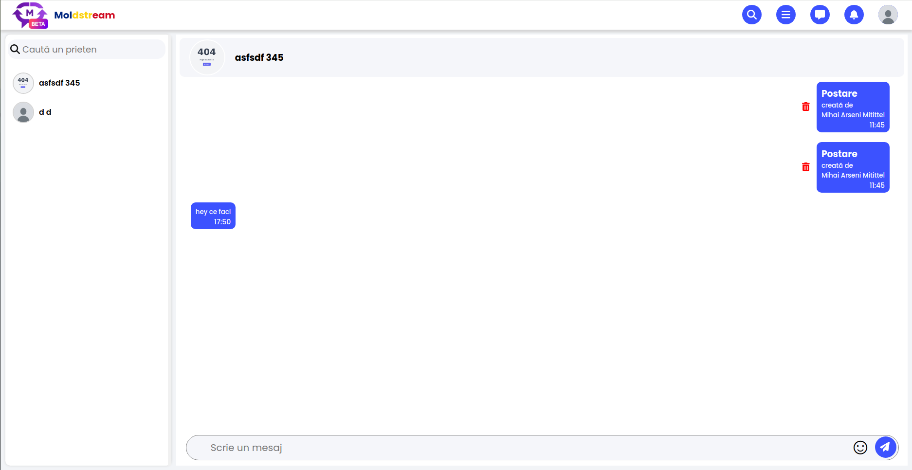</img>
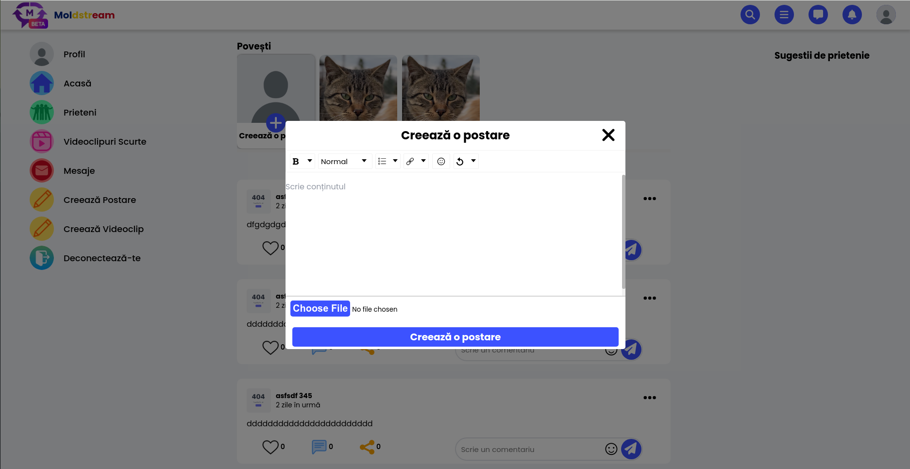</img>
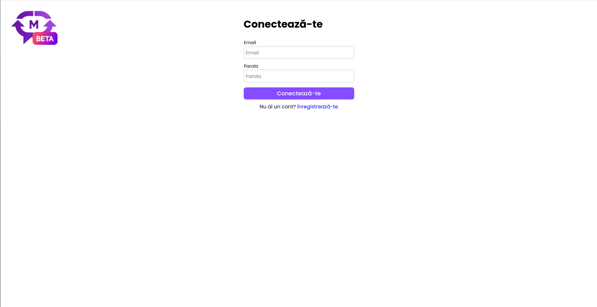</img>
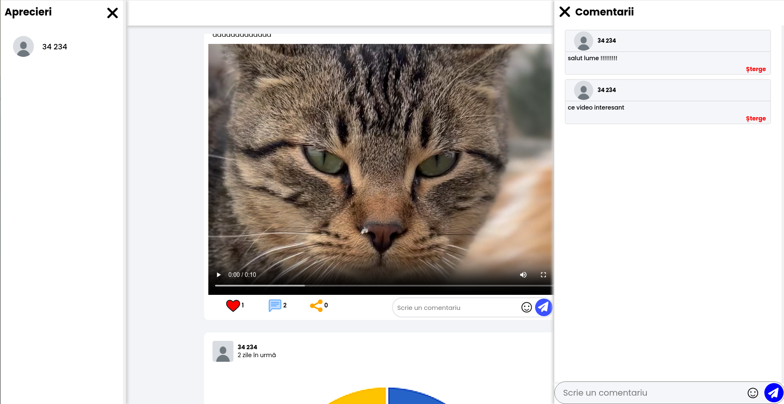</img>
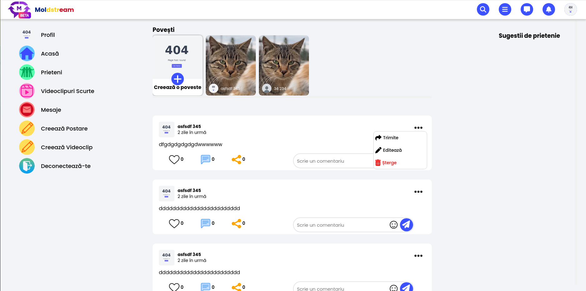</img>
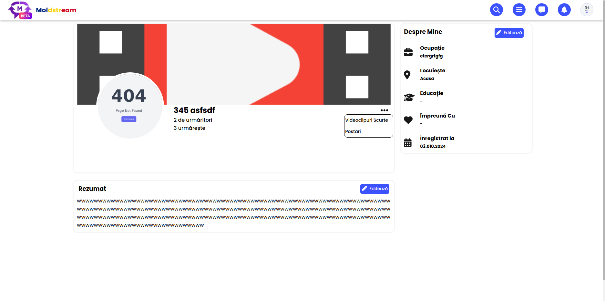</img>
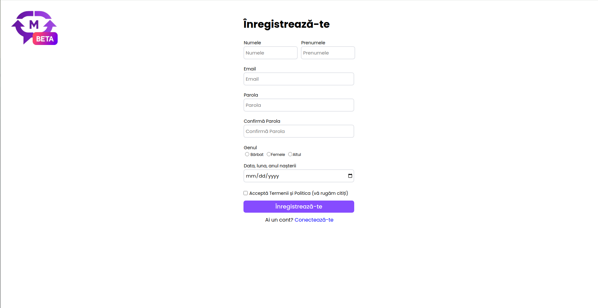</img>
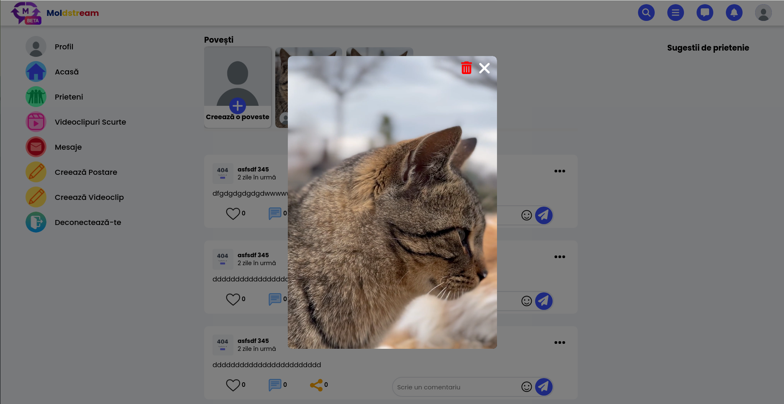</img>
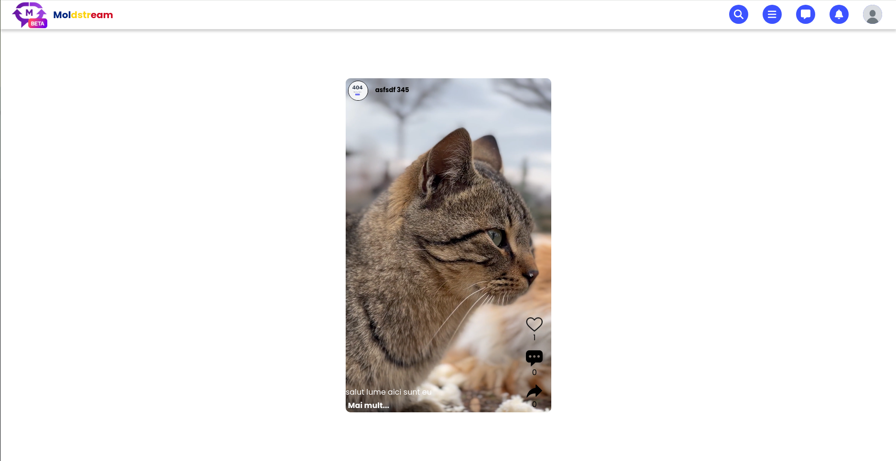</img>
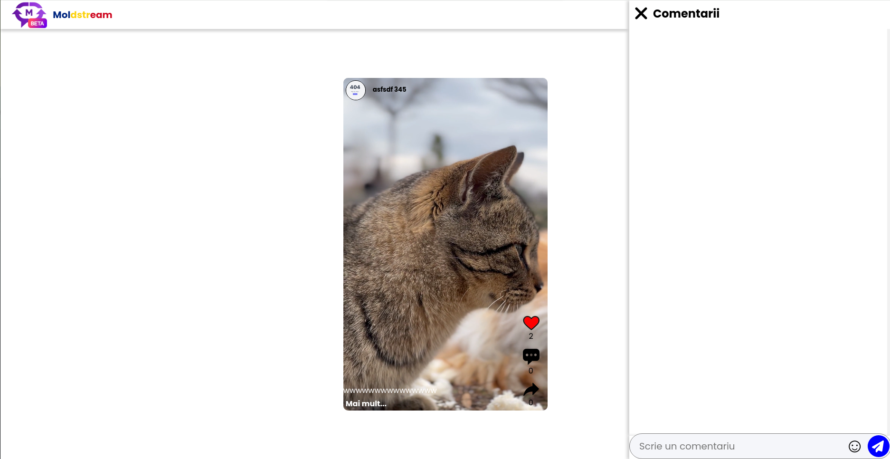</img>
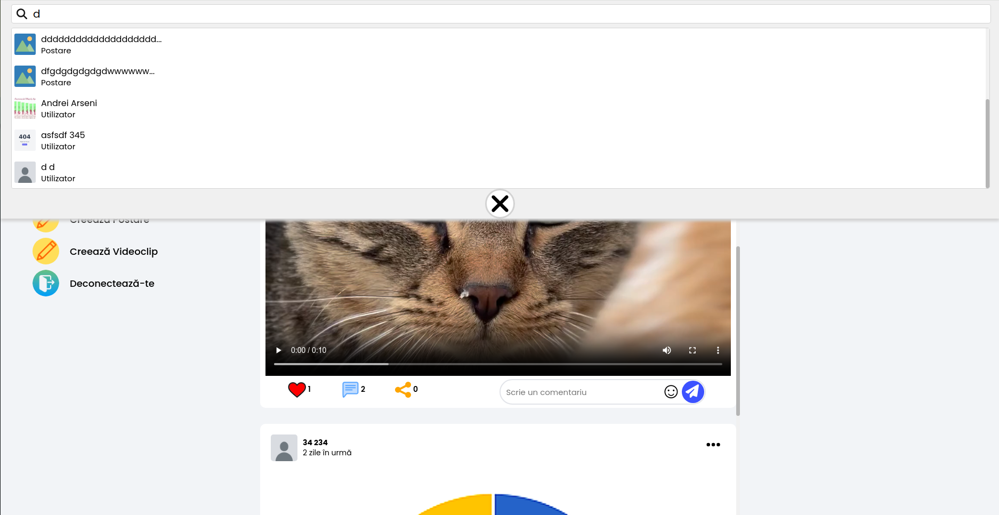</img>
